# Go-Sel: Virtual Lab Pathfinding

> **Antar lewat sel, lihat algoritmanya mikir.**

Virtual lab berbasis web untuk mempelajari algoritma pencarian jalur (pathfinding) pada materi **Berpikir Komputasional** (TPB ITB). Dibuat untuk tugas **II3140 Web and Mobile Application Development**.

- **Demo:** https://soyuzn.github.io/go-sel/
- **Repositori:** https://github.com/Soyuzn/go-sel

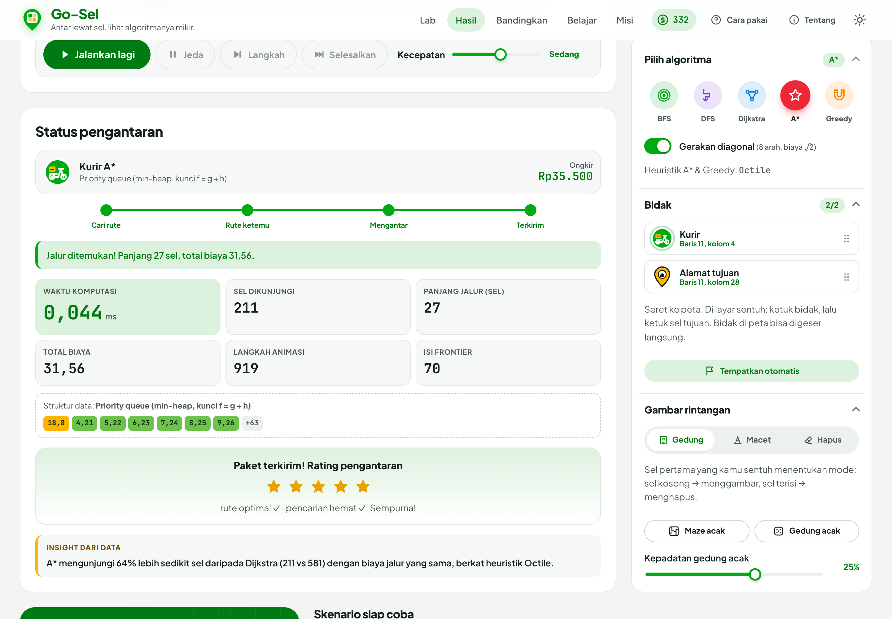

## Deskripsi singkat

**Go-Sel** adalah virtual lab berbasis web untuk mempelajari algoritma pencarian jalur (pathfinding) pada mata kuliah Berpikir Komputasional. Pengguna mengatur ukuran grid, menyeret ikon kurir dan alamat tujuan ke peta, menggambar gedung atau jalan macet sebagai rintangan, lalu memilih algoritma (BFS, DFS, Dijkstra, A*, atau Greedy Best-First). Proses "berpikir" algoritma divisualisasikan langkah demi langkah di atas canvas: sel yang masuk antrean, sel yang sudah dikunjungi, dan jalur akhir yang ditemukan. Setiap eksekusi menampilkan waktu komputasi (ms), jumlah sel dikunjungi, dan panjang jalur, sehingga pengguna dapat membandingkan efisiensi dan optimalitas tiap algoritma. Lab ini juga dilengkapi gamifikasi bergaya aplikasi ojek online (SelPoin, level kurir, misi, rating bintang, dan kuis berbasis data peta). Dibangun dengan HTML5 (semantic elements, canvas, Drag and Drop API, dialog), CSS3 (custom properties, grid/flexbox, responsive, dark mode), dan JavaScript murni tanpa library.

## Cara menjalankan

Tidak perlu instalasi, build step, atau backend.

1. Buka `index.html` langsung di browser (klik dua kali), **atau**
2. Jalankan server lokal:
   ```bash
   python3 -m http.server 8000
   ```
   lalu buka http://localhost:8000

Uji logika algoritma: buka `tests.html` (48 assertion otomatis, tampil hijau/merah).

## Fitur

**Lab**
- Grid 5–60 baris × 5–100 kolom, ukuran sel menyesuaikan layar (`ResizeObserver`, tajam di layar retina).
- Seret **Kurir** dan **Alamat tujuan** ke peta (HTML5 Drag and Drop). Di HP: ketuk bidak lalu ketuk sel. Bidak di peta bisa digeser langsung.
- Gambar gedung dengan menekan dan menggeser (Pointer Events + garis Bresenham supaya tidak ada sel bolong). Alat **Macet** membuat jalan berbiaya ×5.
- 5 algoritma: **BFS, DFS, Dijkstra, A\*, Greedy Best-First**, plus gerakan diagonal (biaya √2, tanpa potong sudut).
- Visualisasi: sel antrean, sel sedang diproses, sel dikunjungi, jalur akhir yang tergambar bertahap, lalu ikon kurir mengantar paket.
- Kontrol: Jalankan, Jeda/Lanjut, Langkah (satu node), Selesaikan, kecepatan (berlaku langsung).
- Nilai g dan h tampil di dalam sel saat sel cukup besar; panel struktur data menampilkan isi queue/stack/priority queue secara langsung.
- Generator **maze acak** (dengan animasi penggalian) dan **gedung acak** (kepadatan 0–40%).
- Pesan **"Tidak ada jalur"** saat tujuan terkurung.

**Hasil & perbandingan**
- Metrik: waktu komputasi (median dari beberapa run, tanpa render), sel dikunjungi, panjang jalur, total biaya, langkah animasi.
- **Bandingkan semua**: tabel 5 algoritma (terbaik per kolom disorot, kolom "optimal" dihitung terhadap Dijkstra) + bar chart di canvas.
- Kalimat **insight** yang dihasilkan dari data, misalnya "A* mengunjungi 64% lebih sedikit sel daripada Dijkstra…".

**Belajar**
- Panel belajar per algoritma (`<details>`): cara kerja, struktur data, kompleksitas, optimal atau tidak, kapan dipakai.
- 6 **skenario siap coba** (thumbnail digambar dari peta aslinya): Kota lengang, Jalan macet, Kantong buntu, Labirin, Pojok bersilangan, Alamat terkurung.

**Gamifikasi (gaya aplikasi ojek online)**
- **SelPoin** dan 5 level kurir (Baru → Legenda), lencana level.
- **14 misi** yang masing-masing melatih satu konsep, misalnya "Jebak si Greedy" atau "Terjebak macet".
- **Rating bintang** tiap pengantaran (optimal? hemat sel?), ongkir main-main, riwayat order.
- **Kuis tebak algoritma** yang soal dan jawabannya dihitung dari peta saat ini.

**Lainnya**
- Default tema terang; mode gelap (hampir hitam) lewat tombol di app bar, dengan transisi lingkaran View Transitions API.
- Simpan/muat peta (`localStorage`), ekspor/impor JSON (atau seret file .json ke peta).
- Link skenario, misalnya `index.html?skenario=trap&algo=greedy&selesai`.
- Pintasan keyboard: `Spasi` jalan/jeda, `S` langkah, `F` selesaikan, `R` ulangi, `C` hapus gedung, `D` diagonal, `1`–`5` algoritma. Peta bisa dioperasikan dengan panah + `Enter`/`K`/`T`.
- Responsif dari 360px sampai desktop, bottom navigation di HP, menghormati `prefers-reduced-motion`.

## Algoritma

| Algoritma | Struktur data | Memilih node | Optimal? | Heuristik |
|---|---|---|---|---|
| BFS | Queue (FIFO) | Langkah terdekat | Ya, jika biaya seragam | Tidak |
| DFS | Stack (iteratif) | Terdalam dulu | Tidak | Tidak |
| Dijkstra | Priority queue (binary heap) | g terkecil | Ya | Tidak |
| A* | Priority queue (binary heap) | f = g + h terkecil (seri → h terkecil) | Ya (h admissible) | Manhattan / Octile |
| Greedy Best-First | Priority queue (binary heap) | h terkecil | Tidak | Manhattan / Octile |

Biaya: lurus 1, diagonal √2, masuk sel macet ×5. Urutan tetangga tetap (atas, kanan, bawah, kiri, lalu diagonal) supaya hasil bisa direproduksi. Semua algoritma adalah fungsi murni tanpa DOM:

```
solve(cells, rows, cols, start, goal, { diagonal, record })
  -> { found, path, cost, visitedCount, events }
```

## Fitur HTML5, CSS, dan JavaScript yang dipakai

- **HTML5:** `header`, `nav`, `main`, `section`, `aside`, `article`, `figure`/`figcaption`, `footer`; 2+ `<canvas>`; Drag and Drop API; `<dialog>`; `<details>`/`<summary>`; `<output>`, `<progress>`, `<fieldset>`/`<legend>`; `<table>` dengan `caption`/`thead`/`scope`; `<template>`; `data-*`; ARIA (`aria-live`, `role="status"`); SVG inline.
- **CSS:** design tokens (custom properties) tema terang/gelap, CSS Grid & Flexbox, `clamp()`, `aspect-ratio`, `color-mix()`, scroll-snap, slider/switch/segmented control kustom, animasi & transisi, `@media print`.
- **JavaScript:** priority queue (binary min-heap) buatan sendiri, 5 algoritma, animator `requestAnimationFrame`, state machine (`IDLE → READY → RUNNING ⇄ PAUSED → DONE`), Pointer Events + Bresenham, benchmark median, maze generator (recursive backtracker), `ResizeObserver`, `IntersectionObserver`, Web Storage, File API, View Transitions API.

## Struktur folder

```
index.html            halaman utama
tests.html            uji otomatis algoritma & skenario
css/
  tokens.css          warna, tipografi, tema terang/gelap
  base.css            reset & tipografi dasar
  layout.css          layout responsif
  components.css      komponen UI & animasi
js/
  algorithms/         common.js (PriorityQueue, heuristik), bfs, dfs, dijkstra, astar, greedy
  grid.js             model grid (Uint8Array)
  state.js            state machine & localStorage
  maze.js             generator maze & gedung acak
  scenarios.js        skenario siap coba
  renderer.js         canvas 2D (lapisan sel + overlay)
  animator.js         pemutar langkah algoritma
  stats.js            timing, tabel, bar chart, insight
  game.js             poin, level, misi, rating, kuis
  input.js            pointer, drag & drop, keyboard
  motion.js           animasi UI
  ui.js               binding DOM
  main.js             pengendali utama
assets/
  icons/              logo & ikon SVG
  screenshots/        screenshot untuk pengumpulan
```

## Screenshot

| | |
|---|---|
| 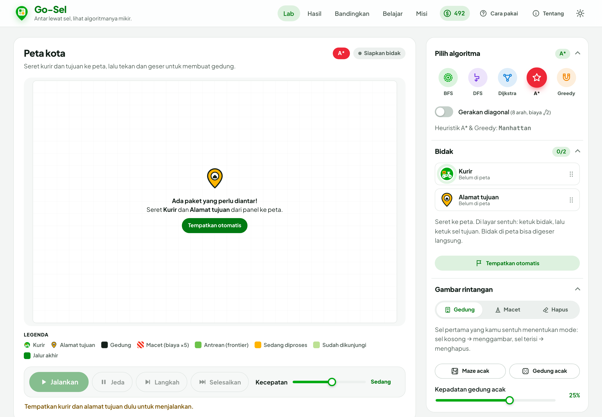 Tampilan awal | 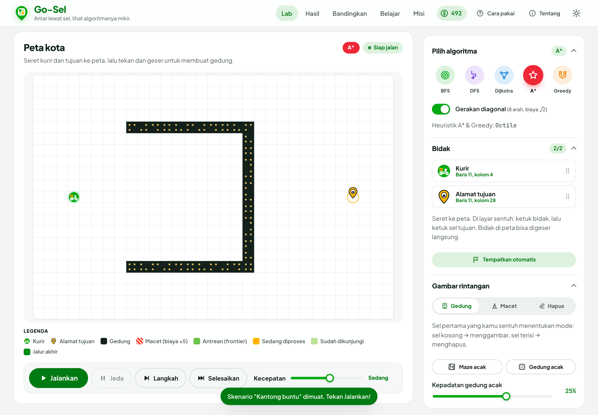 Peta dengan gedung & bidak |
| 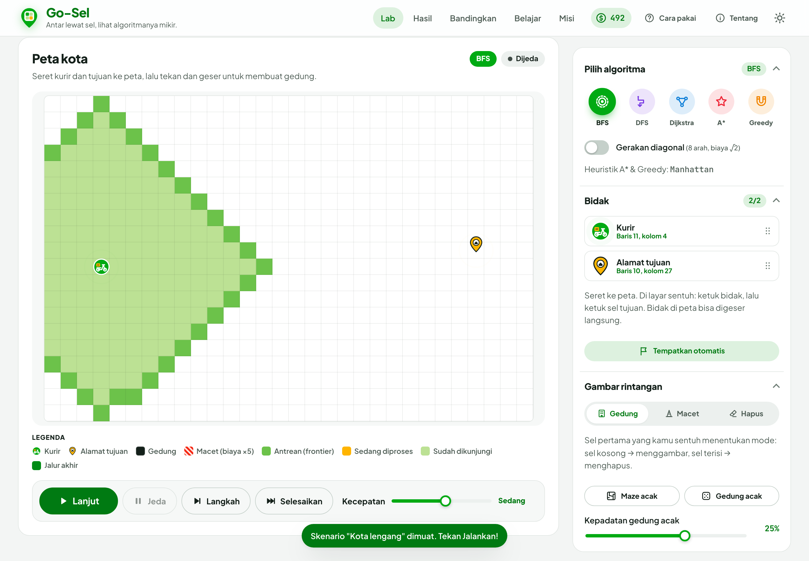 BFS mid-run | 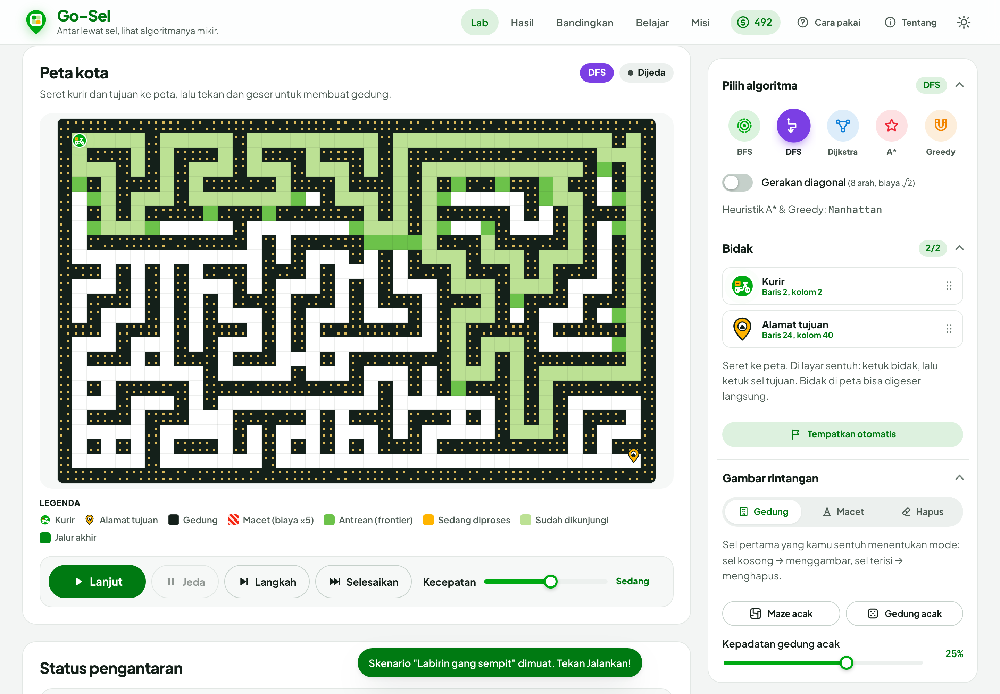 DFS mid-run |
| 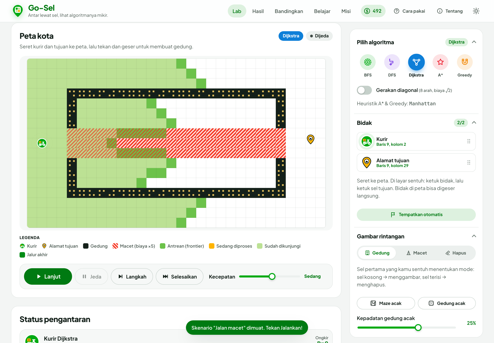 Dijkstra mid-run | 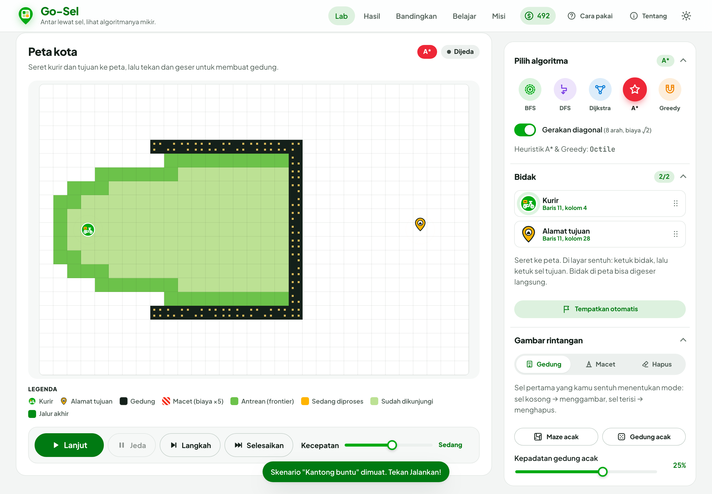 A* mid-run |
| 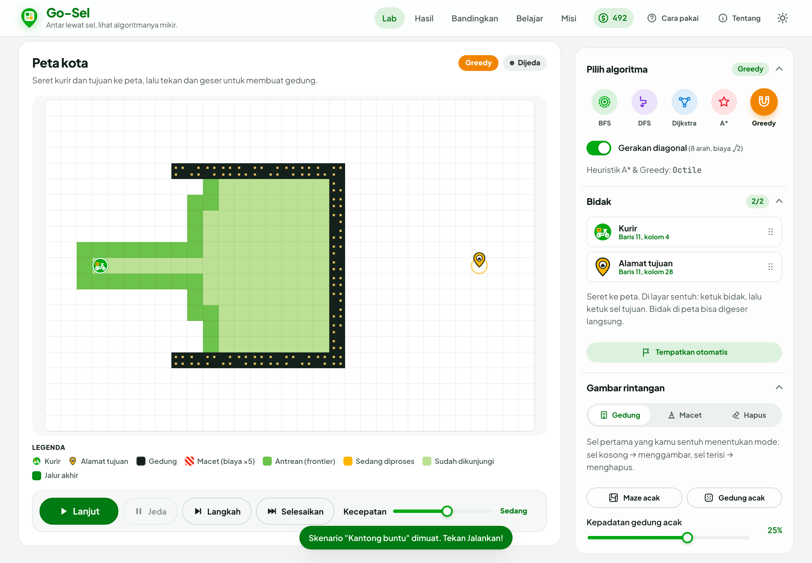 Greedy mid-run |  Hasil akhir |
| 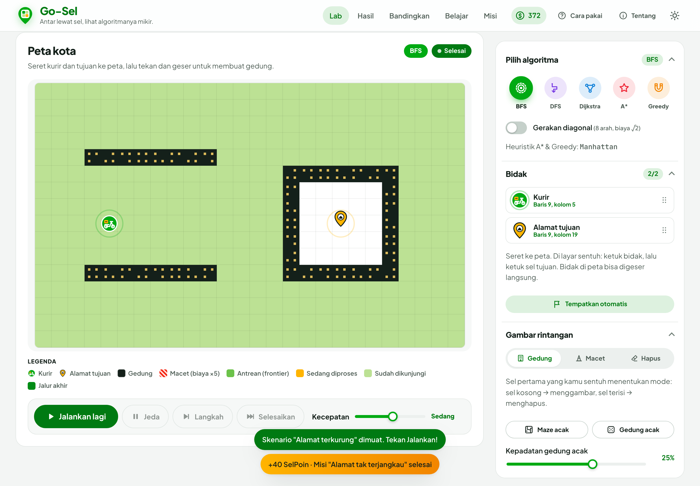 Tidak ada jalur | 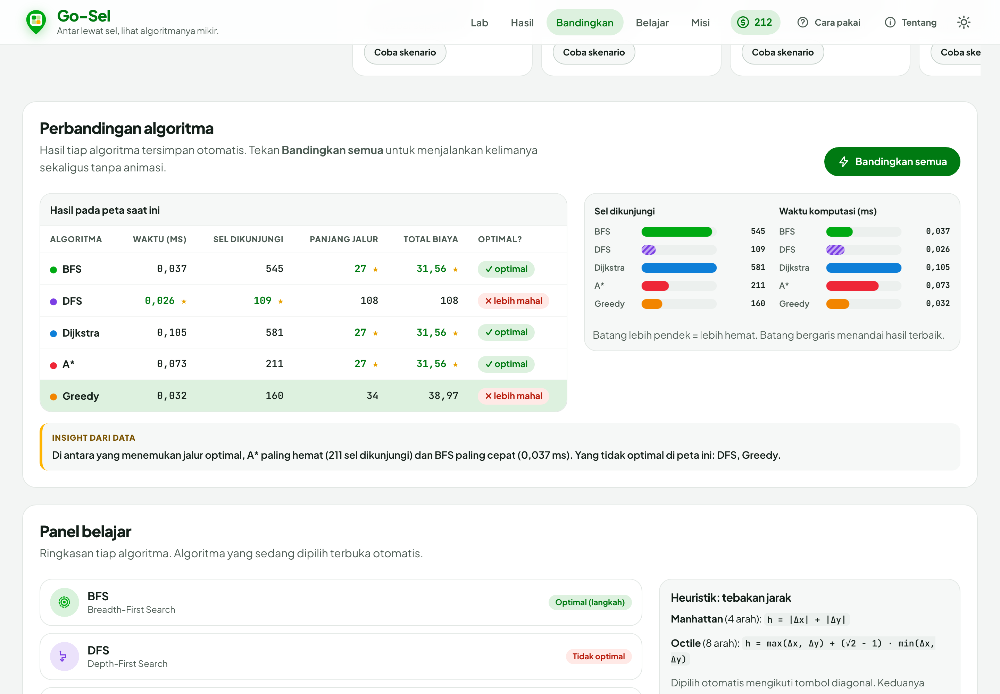 Tabel & bar chart |
| 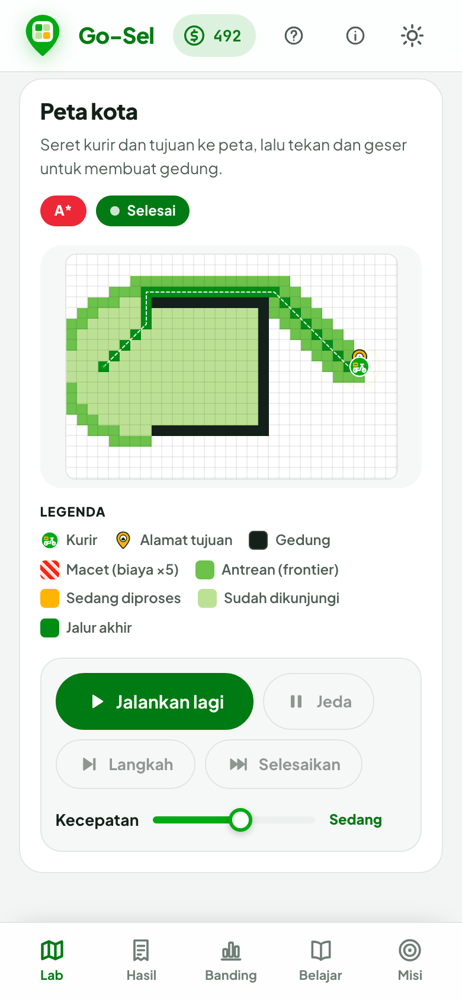 Tampilan mobile | 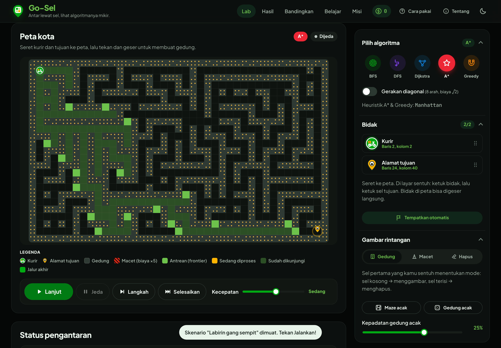 Dark mode |
| 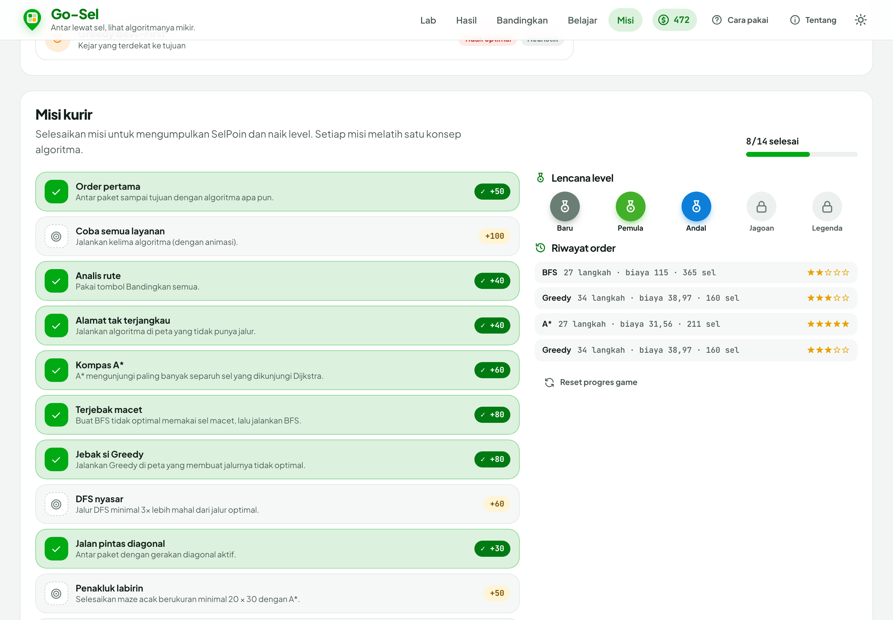 Misi & gamifikasi | 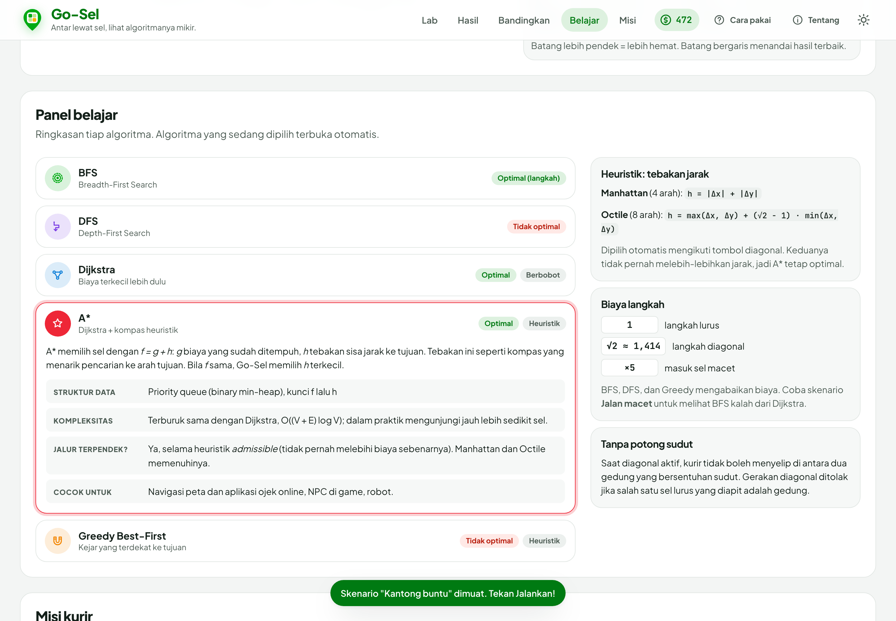 Panel belajar |

## Kredit

- **Nama:** Mishael Gilland
- **NIM:** 18224005
- **Program studi:** Sistem dan Teknologi Informasi, Institut Teknologi Bandung
- **Mata kuliah:** II3140 Web and Mobile Application Development
- **Dosen:** [isi nama dosen]
- **Topik TPB:** Berpikir Komputasional

Tema hijau terinspirasi aplikasi ojek online. Go-Sel tidak berafiliasi dengan Gojek; logo dan ikon dibuat sendiri. Font: Plus Jakarta Sans dan JetBrains Mono (Google Fonts).
